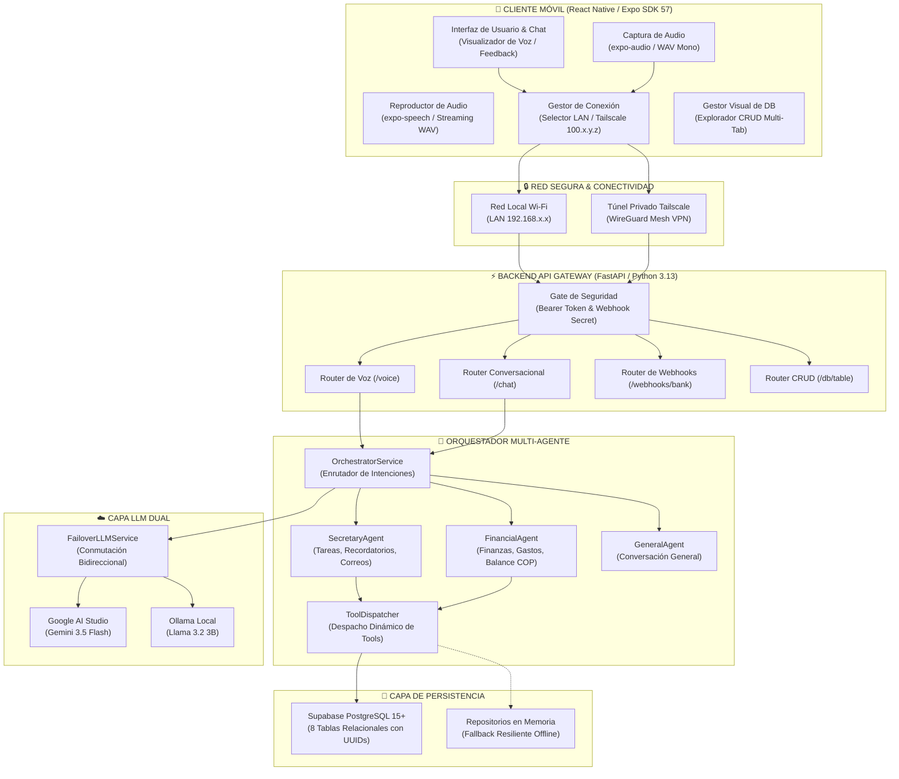

# Asistente Personal Inteligente Multi-Agente con Control por Voz

Sistema integral de asistencia personal móvil con arquitectura desacoplada multi-agente, control bidireccional por voz (Speech-to-Text con Whisper y Text-to-Speech con síntesis WAV), procesamiento de lenguaje natural con conmutación dual automática (Google AI Studio Gemini + Ollama local), persistencia relacional en Supabase (PostgreSQL), ingesta automatizada de notificaciones bancarias por webhook y enlace remoto privado mediante Tailscale (WireGuard).

---

## 📌 Repositorio de Código Fuente y Organización del Proyecto

- **Repositorio Oficial en GitHub**: [https://github.com/DarkFallenStar/AIAssistantMarie](https://github.com/DarkFallenStar/AIAssistantMarie)
- **Código Fuente Comentado y Arquitectura Modular**:
  - `mobile/`: Aplicación móvil completa desarrollada en React Native con Expo SDK 57, TypeScript estricto, gestión de permisos nativos de audio (`expo-audio`), componentes responsivos con desplazamiento ergonómico de teclado y cliente API tipado. Todo el código cuenta con comentarios técnicos, tipado estricto y separación limpia entre pantallas, componentes y servicios.
  - `backend/`: Servidor asíncrono en FastAPI (Python 3.10+) con código extensamente documentado y tipado (Pydantic V2), motor Speech-to-Text Whisper, síntesis TTS WAV, orquestador multi-agente con intents compuestos, catálogo de herramientas (`tools/`), capa de failover LLM y webhook bancario.
  - `database/`: Esquema relacional DDL (`schema.sql`) para Supabase PostgreSQL 15+ y datos iniciales de prueba (`seeds.sql`).
  - `docs/`: Documentación técnica especializada.

---

## 📐 Documento Técnico de Arquitectura

El documento técnico de arquitectura principal se encuentra en **[`docs/architecture.md`](docs/architecture.md)** e incluye:
1. **Diagrama de Arquitectura General**: Topología por capas del sistema modelada en Mermaid.
2. **Diagramas de Secuencia Interactivos**:
   - *Flujo conversacional por voz*: Captura de audio -> Whisper STT -> Orquestador -> Sub-agente -> Tools -> Supabase -> Síntesis TTS -> Reproducción en el móvil.
   - *Flujo de ingesta bancaria*: Notificación push Android -> MacroDroid -> Webhook POST por Tailscale -> Extracción estructurada LLM -> Inserción en DB -> Sincronización contable.
3. **Esquema Relacional de Base de Datos Implementado**: Diagrama Entidad-Relación (ER en Mermaid) con las 8 tablas relacionales (`users`, `tasks`, `emails`, `financial_accounts`, `credit_cards`, `loans`, `saving_goals`, `transactions`), atributos, tipos y cardinalidades (con desglose detallado de diccionario de datos en [`docs/database.md`](docs/database.md)).

---

## 1. Descripción General

El **Asistente Personal Inteligente Multi-Agente** ha sido diseñado como una solución de productividad integral y privacidad primero, estructurado en 20 fases continuas de ingeniería bajo la metodología **Spec-Driven Development (SDD)**.

### Capacidades Destacadas:
- **Control por Voz Fluido**: Captura nativa de audio en dispositivo móvil (`expo-audio`), transcripción precisa con Whisper STT en el servidor y respuesta hablada mediante síntesis TTS con streaming de audio en tiempo real.
- **Orquestación Multi-Agente y Descomposición Compuesta**: Enrutador central inteligente capaz de clasificar intenciones simples o compuestas (`agent: "combined"`), ejecutando herramientas de múltiples sub-agentes en secuencia y consolidando la respuesta en lenguaje natural.
- **Agente Secretaria (`SecretaryAgent`)**: Gestión de tareas (creación, listado, actualización, completado por título natural y eliminación), recordatorios cronológicos y gestión de correos electrónicos con **salvaguarda humana obligatoria (Human-in-the-Loop)** antes del envío.
- **Agente Financiero (`FinancialAgent`)**: Asesor contable estricto y sin alucinaciones; calcula flujo de caja, monitorea saldos de cuentas bancarias y billeteras digitales, cupos de tarjetas de crédito, deudas de préstamos y avance de metas de ahorro, operando de forma nativa en **Pesos Colombianos (COP)**.
- **Ingesta Bancaria Autónoma**: Recepción de compras y débitos en tiempo real mediante notificaciones push de Android (interceptadas por MacroDroid o Tasker) enviadas a un webhook seguro con extracción estructurada vía LLM.
- **Conectividad Cifrada Punto a Punto (Tailscale)**: Comunicación privada y segura a través de una red mallada WireGuard sin exponer puertos a Internet ni configurar routers.
- **Persistencia Híbrida Resiliente**: Conexión nativa con PostgreSQL en Supabase respaldada por repositorios en memoria para garantizar disponibilidad offline y durante pruebas unitarias.

---

## 2. Arquitectura del Sistema

El sistema implementa una arquitectura desacoplada por capas:



> 📖 Para una explicación técnica detallada de cada capa y diagramas de secuencia interactivos, consulta [docs/architecture.md](docs/architecture.md).

---

## 3. Requisitos del Sistema

- **Node.js**: Versión 18.x o superior con `npm`.
- **Python**: Versión 3.10 o superior (recomendado Python 3.13) en la máquina host.
- **Dispositivo Móvil**: Smartphone Android con la app **Expo Go** instalada (descargable desde Google Play Store).
- **Tailscale**: Instalado en la PC host y en el smartphone Android (cuenta gratuita en [tailscale.com](https://tailscale.com/)).
- **Base de Datos**: Proyecto en [Supabase](https://supabase.com/) con PostgreSQL 15+.
- **Proveedor LLM** (al menos uno de los siguientes):
  - Clave API gratuita de **Google AI Studio** ([aistudio.google.com](https://aistudio.google.com/)).
  - Servidor **Ollama** ejecutándose localmente con el modelo `llama3.2` descargado.

---

## 4. Instalación Paso a Paso

### 1. Clonar el Repositorio
```powershell
git clone https://github.com/DarkFallenStar/AIAssistantMarie.git PersonalAssistantAI
cd PersonalAssistantAI
```

### 2. Instalar Dependencias del Backend (Python)
1. Abre una terminal en la carpeta `backend`:
   ```powershell
   cd backend
   ```
2. Crea el entorno virtual de Python:
   ```powershell
   python -m venv .venv
   ```
3. Activa el entorno virtual:
   ```powershell
   .venv\Scripts\activate
   ```
4. Instala todas las dependencias necesarias:
   ```powershell
   pip install --upgrade pip
   pip install -r requirements.txt
   ```

### 3. Instalar Dependencias del Cliente Móvil (React Native)
1. Abre una segunda terminal en la raíz del proyecto (`PersonalAssistantAI`):
   ```powershell
   npm install
   ```

---

## 5. Configuración del Proyecto

### Estructura de Directorios
```
PersonalAssistantAI/
├── mobile/                  # Código fuente del cliente móvil (Expo SDK 57)
│   └── src/
│       ├── components/      # Tarjetas de saldo, visualizadores de onda, modales
│       ├── screens/         # Asistente, Diagnóstico, Gestor DB, Automatización
│       ├── services/        # Cliente HTTP, Audio Recorder, TTS Player
│       └── config/          # Direcciones IP y configuración de red
├── src/                     # Réplica sincronizada al 100% para empaquetado raíz
├── backend/                 # Servidor FastAPI
│   ├── app/
│   │   ├── agents/          # Orquestador, Secretary, Financial, General
│   │   ├── api/endpoints/   # Chat, Voice, Webhooks, DB, TTS, Health
│   │   ├── audio/           # Motor STT Whisper y generador de audio TTS
│   │   ├── core/            # Configuración de entorno y seguridad
│   │   ├── schemas/         # Modelos de validación Pydantic
│   │   ├── services/        # Conectores LLM (Gemini, Ollama, Failover)
│   │   └── tools/           # Herramientas operativas de tareas y finanzas
│   ├── tests/               # Suite de 186 pruebas automatizadas
│   ├── run.py               # Punto de entrada con recarga automática
│   └── requirements.txt     # Dependencias de Python
├── database/                # Esquemas DDL y semillas para PostgreSQL
│   ├── schema.sql           # Definición de 8 tablas relacionales con triggers
│   └── seeds.sql            # Datos semilla de prueba
├── docs/                    # Documentación técnica de arquitectura y contratos
│   ├── architecture.md      # Topología y diagramas de secuencia
│   ├── database.md          # Esquema relacional, ER y diccionario de datos
│   ├── api.md               # Especificación OpenAPI / REST contracts
│   ├── agents.md            # Lógica multi-agente, tools y failover
│   └── deployment.md        # Guía operativa y puesta en marcha
├── .specs/                  # Especificaciones ejecutables SDD por fase
└── README.md                # Este documento central
```

---

## 6. Variables de Entorno

Crea el archivo `.env` en la raíz del proyecto a partir de la plantilla `.env.example`:
```powershell
copy .env.example .env
```

### Diccionario de Variables en `.env`:
| Variable | Descripción | Valor por Defecto / Recomendado |
| :--- | :--- | :--- |
| `ENVIRONMENT` | Entorno de ejecución (`development` o `production`). | `development` |
| `PORT` | Puerto de escucha del servidor FastAPI. | `8000` |
| `HOST` | Interfaz de enlace de red (`0.0.0.0` para escuchar en LAN y Tailscale). | `0.0.0.0` |
| `API_BEARER_TOKEN` | Token secreto para proteger las rutas de chat, voz y base de datos. Si se deja vacío, activa modo desarrollo permisivo. | *(cadena aleatoria segura)* |
| `BANK_WEBHOOK_SECRET` | Secreto criptográfico validado mediante encabezado `X-Webhook-Secret` en el webhook bancario. | *(cadena aleatoria segura)* |
| `LLM_PROVIDER` | Estrategia de LLM: `dual` (Gemini + Ollama failover), `google`, `ollama`, o `mock`. | `dual` |
| `GEMINI_API_KEY` | Clave de API obtenida en Google AI Studio. | *(tu clave de Google AI)* |
| `GEMINI_MODEL` | Nombre del modelo en Google AI Studio (`gemini-3.5-flash` recomendado). | `gemini-3.5-flash` |
| `GEMINI_TIMEOUT_SECONDS`| Tiempo máximo en segundos para respuestas de Gemini antes de conmutar a Ollama. | `25.0` |
| `OLLAMA_BASE_URL` | URL de la instancia local de Ollama. | `http://localhost:11434` |
| `OLLAMA_MODEL` | Modelo local instalado en Ollama. | `llama3.2` |
| `SUPABASE_URL` | URL del proyecto Supabase (`https://<tu-id>.supabase.co`). | *(URL de Supabase)* |
| `SUPABASE_KEY` | Llave `service_role` o `anon` del proyecto Supabase. | *(Llave de Supabase)* |
| `EXPO_PUBLIC_BACKEND_URL` | URL predeterminada para el cliente móvil en red local. | `http://192.168.40.15:8000` |
| `EXPO_PUBLIC_TAILSCALE_IP`| Dirección IP fija asignada a la PC host en Tailscale. | `100.95.54.56` |

---

## 7. Ejecución del Backend (FastAPI)

1. En la terminal del backend con el entorno `.venv` activado:
   ```powershell
   backend\.venv\Scripts\python.exe backend\run.py
   ```
2. El servidor iniciará con recarga automática en caliente (`reload=True`), escuchando en:
   - **Localhost**: `http://127.0.0.1:8000`
   - **Red Local Wi-Fi**: `http://192.168.40.15:8000`
   - **Tailscale**: `http://100.95.54.56:8000`
3. Comprueba la disponibilidad en tu navegador abriendo la documentación Swagger:
   - `http://localhost:8000/docs`

---

## 8. Ejecución de la Aplicación Móvil (React Native + Expo)

1. Ajusta tus direcciones IP en [`src/config/index.ts`](src/config/index.ts) y [`mobile/src/config/index.ts`](mobile/src/config/index.ts):
   ```typescript
   export const DEFAULT_LAN_IP = "192.168.40.15";       // Tu IP local en la Wi-Fi
   export const DEFAULT_TAILSCALE_IP = "100.95.54.56";  // Tu IP fija de Tailscale
   export const DEFAULT_PORT = "8000";
   ```
2. Inicia el servidor de desarrollo de Expo desde la raíz del proyecto:
   ```powershell
   npx expo start
   ```
3. Abre la aplicación **Expo Go** en tu smartphone Android.
4. Escanea el código QR que aparece en la consola de comandos.
5. La aplicación compilará mediante Hermes y se desplegará directamente en la pantalla de tu celular.

---

## 9. Configuración de Supabase (Base de Datos PostgreSQL)

1. Inicia sesión en [Supabase](https://supabase.com/) y crea un nuevo proyecto.
2. Abre la sección **SQL Editor** en el panel lateral izquierdo.
3. Copia y ejecuta todo el contenido de [`database/schema.sql`](database/schema.sql). Esto creará las 8 tablas relacionales (`users`, `tasks`, `emails`, `financial_accounts`, `credit_cards`, `loans`, `saving_goals`, `transactions`), las extensiones UUID y los triggers de actualización automática.
4. Copia y ejecuta el contenido de [`database/seeds.sql`](database/seeds.sql) para cargar datos de prueba iniciales.
5. Copia la **URL del Proyecto** y la **API Key** desde *Project Settings -> API* y configúralas en tu `.env`.
6. **Mecanismo de Resiliencia Híbrida**: Si en algún momento no dispones de conexión a Internet o se cae el servicio de Supabase, el backend lo detecta automáticamente en el primer intento de consulta y activa el fallback en memoria sin interrumpir ninguna funcionalidad.

> 📖 Para ver el Diagrama Entidad-Relación (ER) completo y el diccionario de datos de todas las columnas, consulta [docs/database.md](docs/database.md).

---

## 10. Configuración de Ollama y Google AI Studio (Capa LLM Dual)

El sistema soporta conmutación automática bidireccional (`FailoverLLMService`):

### Configurar Google AI Studio (Gemini 3.5 Flash)
1. Genera una API Key gratuita en [Google AI Studio](https://aistudio.google.com/).
2. Asigna en tu `.env`:
   ```env
   GEMINI_API_KEY=tu_clave_aqui
   GEMINI_MODEL=gemini-3.5-flash
   ```
3. `gemini-3.5-flash` ofrece una latencia ultra-baja de entre 2.5s y 4.5s por turno conversacional.

### Configurar Ollama (Ejecución 100% Local)
1. Descarga e instala [Ollama](https://ollama.com/) en tu computadora.
2. Descarga el modelo liviano recomendado:
   ```powershell
   ollama run llama3.2
   ```
3. Asegúrate de que Ollama esté escuchando en `http://localhost:11434`.

### Modo Dual Failover
Configura en `.env`:
```env
LLM_PROVIDER=dual
```
Si Gemini experimenta saturación de cuota o micro-cortes de red, el sistema registra `[LLM-FAILOVER]` y conmuta de inmediato la ejecución hacia Ollama local sin que el usuario experimente errores.

> 📖 Para conocer las firmas de Function Calling y la arquitectura del orquestador, consulta [docs/agents.md](docs/agents.md).

---

## 11. Configuración de Tailscale (Red Mallada Privada)

Tailscale permite a tu dispositivo móvil comunicarse de forma segura con el servidor backend desde cualquier parte del mundo (datos 4G/5G o redes Wi-Fi públicas) sin abrir ningún puerto en tu módem:

1. **En la PC Host**:
   - Instala Tailscale desde [tailscale.com](https://tailscale.com/).
   - Inicia sesión y copia la dirección IP asignada a tu máquina (ej: `100.95.54.56`).
2. **En tu Celular Android**:
   - Instala Tailscale desde Google Play Store.
   - Inicia sesión con la misma cuenta.
   - Conecta la VPN en la app.
3. **Conmutación en 1 Toque en la App Móvil**:
   - Abre la pantalla **"Diagnóstico de Red"** en la app del asistente.
   - Pulsa **"Cambiar a Tailscale (4G / Remoto)"** para conectar remotamente o **"Cambiar a Red Local (Wi-Fi)"** cuando estés en casa.

---

## 12. Configuración de Automatización Bancaria (MacroDroid)

Para capturar automáticamente notificaciones de compras reales desde tu teléfono Android:

1. Instala **MacroDroid** desde Google Play Store y concédele el permiso de **Acceso a Notificaciones** en los ajustes del sistema de Android.
2. Crea una nueva Macro:
   - **Disparador**: Notificación recibida de tus apps de banco (Bancolombia, Nequi, Davivienda, Nu).
   - **Acción**: Solicitud HTTP `POST`.
     - URL: `http://100.95.54.56:8000/webhooks/bank`
     - Encabezado: `X-Webhook-Secret: <tu_BANK_WEBHOOK_SECRET>`
     - Formato: `application/json`
     - Body:
       ```json
       {
         "source": "[notification_app_name]",
         "content": "[notification_title] [notification_message]"
       }
       ```
3. **Simulador Integrado**: Si prefieres probarlo sin realizar transacciones reales, ingresa en la app a la pantalla **"Centro de Notificaciones Bancarias"** y presiona cualquiera de los botones de prueba (*Bancolombia*, *Nequi*, *Davivienda*).

---

## 13. Pruebas Automatizadas del Sistema

El proyecto cuenta con una amplia suite de pruebas unitarias y de integración que validan el 100% de los flujos:

### Pruebas del Backend (186 tests con unittest)
Ejecuta la suite completa de pruebas desde la raíz del backend:
```powershell
cd backend
.venv\Scripts\python.exe -m unittest discover -s tests -p "test_*.py" -v
```

### Pruebas del Cliente Móvil (10 tests con Node 22 Test Runner)
Ejecuta las pruebas de la máquina de estados, permisos de audio y stripping de markdown para TTS:
```powershell
node --test tests/mobile/test_mobile_assistant.test.mjs
```

### Playbook de Aceptación del MVP (12 Pruebas de Verificación Rápida)
1. **Salud del Servidor**: Verificar `GET /health` respondiendo `{"status": "healthy"}`.
2. **Diagnóstico Móvil**: Verificar los tres indicadores en verde (Backend, Supabase y LLM) en la app.
3. **Creación de Tarea por Voz**: Hablar al micrófono *"Anota una tarea urgente para entregar el balance mañana"*.
4. **Completado de Tarea por Título Natural**: Escribir *"Marca como completada la tarea del balance"*.
5. **Consulta de Tareas Pendientes**: Preguntar *"¿Cuáles son mis tareas pendientes?"*.
6. **Consulta de Flujo de Caja**: Preguntar *"¿Cuánto dinero tengo disponible este mes?"*.
7. **Registro Manual de Gasto**: Decir *"Registra un gasto de 35000 pesos en transporte"*.
8. **Simulación de Webhook Bancario**: Enviar un webhook de compra desde el simulador y verificar su inserción.
9. **Impacto Financiero del Webhook**: Preguntar inmediatamente *"¿Cuánto he gastado hoy?"* y comprobar que incluye el webhook.
10. **Comando Compuesto Multi-Agente**: Enviar *"Anota comprar repuestos para la moto y dime cuánto saldo me queda"*.
11. **Flujo de Correo con Human-in-the-Loop**: Pedir *"Envía un correo a profesor@uni.edu con asunto Tesis"* -> confirmar con *"Sí, confírmalo"*.
12. **Prueba Remota por Tailscale**: Apagar la Wi-Fi del celular, activar datos móviles (4G), pulsar el botón de Tailscale en Diagnóstico y enviar un mensaje.

---

## 14. Solución de Problemas (Troubleshooting)

### 1. Error de Socket en Windows (`[Errno 10048]` o peticiones que no llegan)
- **Causa**: Windows a veces mantiene procesos zombi de Python reteniendo el puerto 8000 en segundo plano.
- **Solución**:
  ```powershell
  # Identificar el proceso ocupando el puerto
  netstat -ano | findstr :8000
  # Forzar el cierre del PID detectado
  Stop-Process -Id <PID> -Force
  ```

### 2. Error de Codificación en Consola (`UnicodeEncodeError: 'charmap' codec...`)
- **Causa**: La consola de comandos estándar de Windows utiliza páginas de códigos locales (cp1252) que fallan al imprimir emojis o caracteres UTF-8.
- **Solución**: Todo el código fuente del backend emplea etiquetas ASCII estandarizadas (`[VOICE]`, `[DB]`, `[API]`). Para terminales PowerShell, puedes asegurar UTF-8 con:
  ```powershell
  [Console]::OutputEncoding = [System.Text.Encoding]::UTF8
  $env:PYTHONIOENCODING = "utf-8"
  ```

### 3. Error de Sintaxis UUID en PostgreSQL (`22P02: invalid input syntax for type uuid`)
- **Causa**: Intentar consultar directamente un identificador que no posee formato estándar UUIDv4.
- **Solución**: El backend incluye el validador `is_valid_uuid(id)`. Si se pasa un texto natural (ej. *"entregar reporte"*), el sistema busca por coincidencia parcial en el título en lugar de fallar a nivel de base de datos.

### 4. Error al Subir Audio en Expo (`Unsupported FormDataPart implementation`)
- **Causa**: En React Native 0.86+ y Expo SDK 57 con motor Hermes, el constructor tradicional `FormData.append({ uri, name, type })` está obsoleto.
- **Solución**: El cliente utiliza la API moderna `new File(audioUri).upload(url, { uploadType: UploadType.MULTIPART, fieldName: 'file' })` de `expo-file-system`.

### 5. Error HTTP 503 ("Model experiencing high demand") en Google Gemini
- **Causa**: El modelo preliminar `gemini-3.8-flash` presenta congestión periódica en Google AI Studio.
- **Solución**: Se ha estandarizado la producción en `gemini-3.5-flash`, el cual ofrece disponibilidad continua y respuesta en menos de 4 segundos. Además, el `FailoverLLMService` conmuta a Ollama local si ocurre cualquier eventualidad.

---

## 15. Enlaces a la Documentación Técnica

Para profundizar en el diseño e implementación de cada subsistema:
- [Arquitectura del Sistema y Diagramas de Secuencia](docs/architecture.md)
- [Esquema de Base de Datos y Diagrama ER](docs/database.md)
- [Especificación de Contratos de API REST](docs/api.md)
- [Arquitectura Multi-Agente y Catálogo de Herramientas](docs/agents.md)
- [Guía de Despliegue en Producción y Red Privada](docs/deployment.md)
- [Guía de Automatización Bancaria con MacroDroid](docs/android_notification_listener.md)
