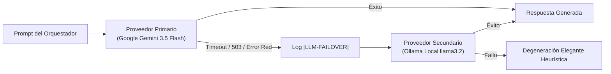

# Arquitectura Multi-Agente: Orquestación, Agentes Especializados y Herramientas

Este documento detalla la arquitectura de inteligencia artificial del sistema, el funcionamiento del **Orquestador Central**, la taxonomía de los **Agentes Especializados**, el catálogo de **Herramientas (Tools)** y el motor de **Conmutación Dual (Failover LLM)**.

---

## 1. Visión General y Filosofía Multi-Agente

El asistente no confía en un único prompt monolítico. En su lugar, opera bajo un patrón **Orchestrator-Workers**, donde un orquestador central analiza la intención del usuario y delega la ejecución en agentes especializados dotados de herramientas deterministas conectadas a la base de datos:

```
                          [ ENTRADA DEL USUARIO ]
                                     │
                                     ▼
                        [ ORCHESTRATOR SERVICE ]
                                     │
                 ┌───────────────────┴───────────────────┐
                 ▼                                       ▼
        [ CLASIFICADOR LLM ]                   [ CLASIFICADOR HEURÍSTICO ]
   (StructuredIntent JSON Output)              (Reglas, Regex y Palabras Clave)
                 │                                       │
                 └───────────────────┬───────────────────┘
                                     │
                    ┌────────────────┼────────────────┐
                    ▼                ▼                ▼
           [ SECRETARY AGENT ] [ FINANCIAL AGENT ] [ GENERAL AGENT ]
                    │                │                │
                    └────────────────┼────────────────┘
                                     │
                         [ TOOL DISPATCHER ]
                                     │
       ┌───────────┬───────────┬─────┴─────┬───────────┬───────────┐
       ▼           ▼           ▼           ▼           ▼           ▼
   TaskTools  EmailTools  ReminderTools CashFlow  CreditCards   Loans
```

---

## 2. El Orquestador Central (`OrchestratorService`)

El archivo [`backend/app/agents/orchestrator.py`](file:///c:/Users/kenny/OneDrive/Documents/Cosas%20de%20movil%20que%20lo%20buguie%20todo/PersonalAssistantAI/PersonalAssistantAI/backend/app/agents/orchestrator.py) implementa el cerebro de coordinación del sistema:

### A. Clasificación Híbrida de Intenciones
1. **Ruta Principal (LLM Structured Output)**:
   - Envía el mensaje del usuario junto con el esquema Pydantic `StructuredIntent` al proveedor LLM activo.
   - El modelo devuelve un JSON estructurado con el agente de destino (`secretary`, `financial`, `general` o `combined`), la herramienta solicitada y sus argumentos exactos.
2. **Ruta de Respaldo (Heurística Determinista)**:
   - Si el LLM está ocupado, sin conexión o responde con un formato no parseable, se activa de forma instantánea el clasificador heurístico.
   - Evalúa palabras clave ponderadas (`tarea`, `recuérdame`, `correo` -> Secretaria; `plata`, `saldo`, `gasto`, `tarjeta`, `préstamo` -> Finanzas).

### B. Descomposición de Intenciones Compuestas (`agent: "combined"`)
Cuando un usuario emite un comando mixto como:
> *"Anota una tarea de pagar el arriendo y dime cuánto saldo tengo en mis cuentas"*

El orquestador no se confunde ni prioriza una sola petición:
1. El clasificador emite un `StructuredIntent` con `agent: "combined"` y un arreglo de `actions`:
   - Acción 1: `agent="secretary"`, `tool="create_task"`, `arguments={"title": "Pagar el arriendo"}`.
   - Acción 2: `agent="financial"`, `tool="calculate_cash_flow"`, `arguments={"period": "current_month"}`.
2. El orquestador ejecuta secuencialmente cada herramienta a través de su respectivo sub-agente.
3. Consolida todas las salidas operativas (`tools_executed: ["create_task", "calculate_cash_flow"]`).
4. Invoca al LLM para sintetizar una respuesta única, fluida y coherente en lenguaje natural:
   > *"Listo, anoté la tarea 'Pagar el arriendo' y tu balance total disponible es $3.500.000 COP."*

---

## 3. Agente Secretaria (`SecretaryAgent`)

Ubicado en [`backend/app/agents/secretary.py`](file:///c:/Users/kenny/OneDrive/Documents/Cosas%20de%20movil%20que%20lo%20buguie%20todo/PersonalAssistantAI/PersonalAssistantAI/backend/app/agents/secretary.py), es responsable de la productividad personal, gestión del tiempo y comunicaciones.

### Herramientas que Controla:
1. **`TaskTools` (`task_tool.py`)**:
   - `create_task(title, description, priority, due_date)`: Registra nuevas tareas con UUIDv4 en Supabase.
   - `list_tasks(status, priority, limit)`: Consulta tareas pendientes o completadas.
   - `complete_task(task_id)`: Marca una tarea como completada. Soporta tanto el UUID exacto como la búsqueda por título natural (ej. *"entregar reporte"*).
   - `update_task(task_id, ...)`: Modifica prioridad, título o fechas límite.
   - `delete_task(task_id)`: Elimina la tarea por UUID o coincidencia de título.
2. **`ReminderTools` (`reminder_tool.py`)**:
   - `create_reminder(title, remind_at)`: Registra recordatorios temporales (almacenados en `tasks` con `category="reminder"`).
   - `list_reminders()`: Lista recordatorios activos.
   - `cancel_reminder(id)`: Cancela un recordatorio específico.
3. **`EmailTools` (`email_tool.py`)**:
   - `list_unread_emails(limit)`: Consulta correos no leídos en la bandeja.
   - `search_emails(query)`: Busca correos por remitente, asunto o contenido.
   - **Salvaguarda Humana Obligatoria (Human-in-the-Loop)**:
     - El agente **NUNCA** despacha un correo de forma autónoma.
     - Al solicitar el envío, el agente genera un borrador y responde con `requires_confirmation: True`, mostrando destinatario, asunto y mensaje al usuario.
     - Únicamente tras la confirmación afirmativa explícita del usuario (*"Sí, envíalo"*, *"confirmo"*), el correo es formalmente emitido mediante el cliente IMAP/SMTP o mock.

---

## 4. Agente Financiero (`FinancialAgent`)

Ubicado en [`backend/app/agents/financial.py`](file:///c:/Users/kenny/OneDrive/Documents/Cosas%20de%20movil%20que%20lo%20buguie%20todo/PersonalAssistantAI/PersonalAssistantAI/backend/app/agents/financial.py), actúa como asesor y controlador contable personal.

### Principio Fundamental: Grounding Estricto y Cero Alucinación
El `FinancialAgent` tiene prohibido inventar o estimar cifras. Todos los valores (saldos, cuotas, tasas de interés, límites de crédito) deben provenir estrictamente de consultas verificadas a las tablas de PostgreSQL. Si una cuenta o tarjeta no existe en la base de datos, el agente debe declarar explícitamente que no dispone de registros.

### Moneda Oficial: Peso Colombiano (COP)
Todos los montos numéricos operan de forma predeterminada en **COP**, utilizando formateo con separadores de miles estándar (`$45.000 COP`, `$3.500.000 COP`).

### Herramientas que Controla:
1. **`CashFlowTools` (`cashflow_tool.py`)**:
   - `calculate_cash_flow(period)`: Suma saldos de cuentas líquidas, totaliza ingresos y gastos del mes actual y computa el flujo neto disponible.
2. **`TransactionTools` (`transaction_tool.py`)**:
   - `create_transaction(amount, type, category, description, merchant, source)`: Inserta un movimiento contable en la base de datos.
   - `get_transactions(limit, category)`: Lista las transacciones más recientes ordenadas cronológicamente.
   - `delete_transaction(transaction_id)`: Elimina un movimiento erróneo por UUID.
3. **`CreditCardTools` (`credit_card_tool.py`)**:
   - `get_credit_cards()`: Lista tarjetas, cupo asignado, saldo consumido y cupo disponible calculado (`credit_limit - current_balance`).
4. **`LoanTools` (`loan_tool.py`)**:
   - `get_loans()`: Reporta saldo de capital pendiente, tasa de interés anual, cuota fija mensual y día de pago.
5. **`SavingGoalTools` (`saving_goal_tool.py`)**:
   - `get_saving_goals()`: Reporta metas de ahorro, porcentaje de progreso acumulado (`current / target * 100`) y fecha límite.

---

## 5. Agente General (`GeneralAgent`)

Ubicado en [`backend/app/agents/general.py`](file:///c:/Users/kenny/OneDrive/Documents/Cosas%20de%20movil%20que%20lo%20buguie%20todo/PersonalAssistantAI/PersonalAssistantAI/backend/app/agents/general.py), maneja saludos, agradecimientos, explicaciones sobre las capacidades del sistema y respuestas fuera de dominio sin alterar la base de datos ni ejecutar herramientas operativas.

---

## 6. Despachador Dinámico de Herramientas (`ToolDispatcher`)

Ubicado en [`backend/app/tools/dispatcher.py`](file:///c:/Users/kenny/OneDrive/Documents/Cosas%20de%20movil%20que%20lo%20buguie%20todo/PersonalAssistantAI/PersonalAssistantAI/backend/app/tools/dispatcher.py):
- Centraliza el registro de todas las herramientas operativas.
- Provee los esquemas JSON de Function Calling presentados en el system prompt de los modelos.
- Valida los argumentos recibidos contra los tipos esperados y despacha la ejecución asíncrona hacia el método correspondiente.
- Retorna un objeto estándar `ToolExecutionResult(success, message, data, error)`.

---

## 7. Motor de Resiliencia LLM (`FailoverLLMService`)

Ubicado en [`backend/app/services/llm/failover.py`](file:///c:/Users/kenny/OneDrive/Documents/Cosas%20de%20movil%20que%20lo%20buguie%20todo/PersonalAssistantAI/PersonalAssistantAI/backend/app/services/llm/failover.py):



- **Perfil de Modelos**:
  - `gemini-3.5-flash`: Recomendado para producción. Respuestas ultra-rápidas en 2.5s - 4.5s.
  - `llama3.2:3b`: Modelo local en Ollama, privado, sin coste y ejecutable offline.
- **Temporización (Timeouts)**:
  - `GEMINI_TIMEOUT_SECONDS`: Ajustado a `25.0s` para evitar cancelaciones prematuras en conexiones lentas.
  - El cliente móvil (`src/services/api.ts`) mantiene un timeout holgado de `35000ms` (35s) para dar tiempo a la conmutación completa si un proveedor sufre latencia.
