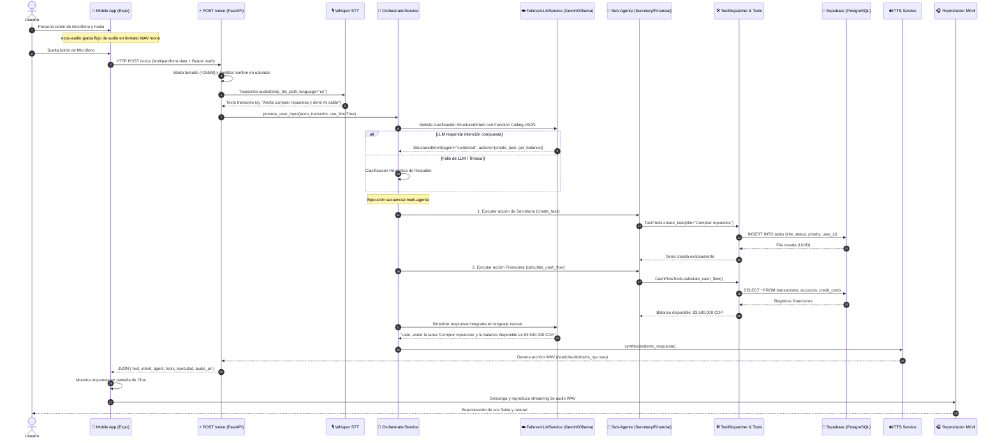
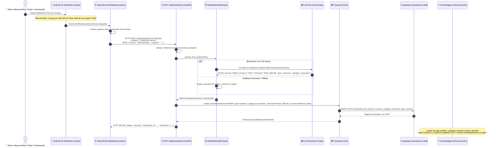

# Arquitectura del Sistema: Asistente Personal Multi-Agente con Control por Voz

Este documento detalla la topología técnica, principios de diseño, flujo de datos y diagramas formales (arquitectura y secuencias) del **Asistente Personal Inteligente Multi-Agente**.

---

## 1. Principios y Filosofía de Diseño

El sistema está diseñado bajo una arquitectura modular y desacoplada que prioriza:

1. **Spec-Driven Development (SDD)**: Cada componente, endpoint y tabla se rige por contratos formales ejecutables antes de la implementación, garantizando cero deriva arquitectónica.
2. **Resiliencia Extrema y Degeneración Elegante**:
   - **Capa LLM Dual**: Conmutación automática bidireccional (Failover) entre Google AI Studio (Gemini 3.5 Flash) y Ollama local (`llama3.2`). Si ambos fallan o no hay conexión externa, el sistema responde mediante clasificación heurística y ejecución determinista.
   - **Capa de Datos Híbrida**: Supabase PostgreSQL opera como fuente única de la verdad (SSOT). En caso de indisponibilidad de red, repositorios seguros en memoria mantienen la operabilidad continua sin lanzar excepciones no controladas.
3. **Privacidad y Seguridad Punto a Punto**:
   - Red privada mallada mediante **Tailscale** (WireGuard), eliminando la necesidad de abrir puertos o configurar NAT/DDNS en enrutadores residenciales.
   - Autenticación en capas con tokens Bearer (`API_BEARER_TOKEN`) y secretos criptográficos para webhooks (`BANK_WEBHOOK_SECRET`).
4. **Ergonomía Móvil y Rendimiento**:
   - Cliente desarrollado en **React Native** con **Expo SDK 57**, aprovechando el motor Hermes, APIs nativas modernas (`expo-audio`, `react-native-safe-area-context`) y control ergonómico del teclado virtual.

---

## 2. Diagrama de Arquitectura General

El siguiente diagrama modela la interacción entre los subsistemas del cliente móvil, la capa de red segura, el servidor backend FastAPI, los agentes especializados, los motores de lenguaje y la base de datos:

```mermaid
graph TB
    subgraph MobileClient ["📱 CLIENTE MÓVIL (React Native / Expo SDK 57)"]
        UI["Interfaz de Usuario & Chat\n(Visualizador de Voz / Feedback)"]
        AudioRec["Captura de Audio\n(expo-audio / WAV Mono)"]
        AudioPlayer["Reproductor de Audio\n(expo-speech / Streaming WAV)"]
        NetManager["Gestor de Conexión\n(Selector LAN / Tailscale 100.x.y.z)"]
        ChatStore["Almacén de Chat Local\n(expo-file-system Storage)"]
        DBManager["Gestor Visual de DB\n(Explorador CRUD Multi-Tab)"]
    end

    subgraph SecureNetwork ["🔒 RED SEGURA & CONECTIVIDAD"]
        TailscaleMesh["Túnel Privado Tailscale\n(WireGuard Mesh VPN)"]
        LocalLAN["Red Local Wi-Fi\n(LAN 192.168.x.x)"]
    end

    subgraph BackendGateway ["⚡ BACKEND API GATEWAY (FastAPI / Python 3.13)"]
        AuthMiddleware["Gate de Seguridad\n(Bearer Token & Webhook Secret)"]
        StaticAudioServer["Servidor de Archivos Estáticos\n(/static/audio/tts/)"]
        HealthRouter["Endpoints de Diagnóstico\n(/health, /db/status, /db/summary)"]
        ChatRouter["Router Conversacional\n(/chat)"]
        VoiceRouter["Router de Voz\n(/voice - STT Whisper)"]
        WebhookRouter["Router de Webhooks Bancarios\n(/webhooks/bank)"]
        DBRouter["Router CRUD de Base de Datos\n(/db/table/{name})"]
    end

    subgraph AudioProcessing ["🎙️ MOTOR DE AUDIO & VOZ"]
        WhisperSTT["STT Whisper Engine\n(tiny / int8 en Español)"]
        TTSFastSpeech["TTS WAV Speech Synthesizer\n(Generación de Audio en Servidor)"]
    end

    subgraph OrchestrationLayer ["🧠 CAPA DE ORQUESTACIÓN MULTI-AGENTE"]
        Orchestrator["OrchestratorService\n(Enrutamiento de Intenciones)"]
        IntentClassifier["Clasificador de Intenciones\n(Structured LLM + Heurística)"]
        MultiAgentDecomp["Descompositor Compuesto\n(agent: combined / Múltiples Acciones)"]
        ToolDispatcher["ToolDispatcher\n(Despacho Dinámico de Herramientas)"]
    end

    subgraph SpecializedAgents ["🤖 AGENTES ESPECIALIZADOS"]
        SecretaryAgent["SecretaryAgent\n(Tareas, Recordatorios, Correos)"]
        FinancialAgent["FinancialAgent\n(Flujo de Caja, Gastos, Tarjetas, COP)"]
        GeneralAgent["GeneralAgent\n(Conversación General & Fallback)"]
    end

    subgraph ToolsCatalog ["🛠️ CATÁLOGO DE HERRAMIENTAS"]
        TaskTools["TaskTools (CRUD Tareas)"]
        ReminderTools["ReminderTools (Recordatorios)"]
        EmailTools["EmailTools (Draft & HITL Confirm)"]
        CashFlowTools["CashFlowTools (Balance & Flujo)"]
        TransactionTools["TransactionTools (Gastos/Ingresos)"]
        CreditCardTools["CreditCardTools (Cupos & Tarjetas)"]
        LoanTools["LoanTools (Deudas & Amortización)"]
        SavingGoalTools["SavingGoalTools (Metas de Ahorro)"]
    end

    subgraph PersistenceLayer ["💾 CAPA DE PERSISTENCIA"]
        SupabasePostgres["Supabase PostgreSQL 15+\n(Esquema Relacional con UUIDs)"]
        InMemoryFallback["Repositorios en Memoria\n(Fallback Resiliente Offline)"]
    end

    subgraph LLMLayer ["☁️ CAPA DE INFERENCIA LLM (DUAL FAILOVER)"]
        FailoverService["FailoverLLMService\n(Conmutación Automática Bidireccional)"]
        GeminiPrimary["Google AI Studio\n(Gemini 3.5 Flash Lite / Flash)"]
        OllamaSecondary["Ollama Local Engine\n(Llama 3.2 3B / Qwen 2.5)"]
    end

    subgraph ExternalAutomation ["📲 AUTOMATIZACIÓN EXTERNA"]
        BankApp["App Bancaria / SMS\n(Bancolombia, Nequi, Davivienda)"]
        MacroDroid["MacroDroid / Tasker\n(NotificationListenerService)"]
    end

    %% Mobile connection flows
    UI --> NetManager
    AudioRec --> NetManager
    NetManager --> LocalLAN
    NetManager --> TailscaleMesh
    LocalLAN --> AuthMiddleware
    TailscaleMesh --> AuthMiddleware

    %% Gateway to endpoints
    AuthMiddleware --> ChatRouter
    AuthMiddleware --> VoiceRouter
    AuthMiddleware --> WebhookRouter
    AuthMiddleware --> DBRouter
    AuthMiddleware --> HealthRouter

    %% Voice pipeline
    VoiceRouter --> WhisperSTT
    WhisperSTT --> Orchestrator
    ChatRouter --> Orchestrator

    %% Orchestration
    Orchestrator --> IntentClassifier
    IntentClassifier --> MultiAgentDecomp
    MultiAgentDecomp --> SecretaryAgent
    MultiAgentDecomp --> FinancialAgent
    MultiAgentDecomp --> GeneralAgent

    %% Agents to Tools
    SecretaryAgent --> ToolDispatcher
    FinancialAgent --> ToolDispatcher
    ToolDispatcher --> TaskTools
    ToolDispatcher --> ReminderTools
    ToolDispatcher --> EmailTools
    ToolDispatcher --> CashFlowTools
    ToolDispatcher --> TransactionTools
    ToolDispatcher --> CreditCardTools
    ToolDispatcher --> LoanTools
    ToolDispatcher --> SavingGoalTools

    %% Tools to DB
    TaskTools --> SupabasePostgres
    TaskTools -.-> InMemoryFallback
    TransactionTools --> SupabasePostgres
    TransactionTools -.-> InMemoryFallback
    CreditCardTools --> SupabasePostgres
    CreditCardTools -.-> InMemoryFallback
    LoanTools --> SupabasePostgres
    LoanTools -.-> InMemoryFallback
    SavingGoalTools --> SupabasePostgres
    SavingGoalTools -.-> InMemoryFallback
    EmailTools --> SupabasePostgres
    EmailTools -.-> InMemoryFallback

    %% Agents to LLM
    IntentClassifier --> FailoverService
    SecretaryAgent --> FailoverService
    FinancialAgent --> FailoverService
    FailoverService --> GeminiPrimary
    FailoverService --> OllamaSecondary

    %% TTS feedback
    Orchestrator --> TTSFastSpeech
    TTSFastSpeech --> StaticAudioServer
    StaticAudioServer -.-> AudioPlayer

    %% Bank automation
    BankApp --> MacroDroid
    MacroDroid --> TailscaleMesh
    WebhookRouter --> TransactionTools
```

---

## 3. Diagramas de Secuencia

### Diagrama de Secuencia 1: Flujo de Interacción por Voz Conversacional

El siguiente diagrama detalla la interacción paso a paso cuando el usuario graba un comando de voz desde su teléfono Android:

---

### Diagrama de Secuencia 2: Ingesta Automática de Notificaciones Bancarias

El siguiente diagrama describe cómo se procesa de forma autónoma una compra bancaria detectada en el teléfono del usuario:

---

## 4. Desglose de Capas del Sistema

### A. Capa de Presentación Móvil (React Native + Expo)
- **Estructura y Tipado**: Totalmente desarrollado en TypeScript estricto. Mantiene paridad 100% entre `src/` y `mobile/src/`.
- **Navegación y Vistas**:
  1. `AssistantScreen.tsx`: Pantalla principal conversacional con historial en tiempo real, burbujas de chat, botón de voz pulsable y visualizador de estado.
  2. `ConnectionDiagnosticScreen.tsx`: Diagnóstico integral de tres niveles (Backend, Base de Datos Supabase y LLM), con conmutador de 1 toque entre Red Wi-Fi Local (`192.168.40.15`) y Red Tailscale (`100.95.54.56`).
  3. `DatabaseManagerScreen.tsx`: Gestor de datos visual con navegación por pestañas (`Tareas`, `Recordatorios`, `Transacciones`, `Cuentas`, `Tarjetas`, `Préstamos`, `Metas`, `Correos`), con capacidades completas de creación, edición y eliminación (CRUD).
  4. `NotificationAutomationScreen.tsx`: Centro de pruebas y simulación de notificaciones bancarias con presets de Bancolombia, Nequi, Davivienda y Nu.
- **Manejo de Teclado**: Implementación ergonómica mediante `KeyboardAvoidingView` (`behavior="height"` en Android y `"padding"` en iOS) con persistencia de toques `keyboardShouldPersistTaps="handled"`.

### B. Capa de Red y Conectividad (Tailscale WireGuard)
- **Enlace Cifrado Seguro**: El backend enlaza en `0.0.0.0:8000`, estando disponible en simultáneo sobre `localhost`, la red Wi-Fi LAN y la interfaz virtual de Tailscale (`100.x.y.z`).
- **Sin Apertura de Puertos**: No requiere reenvío de puertos (Port Forwarding), DMZ ni exposición pública de IP. Todas las transmisiones están cifradas mediante WireGuard.

### C. Capa de Backend y API (FastAPI)
- **Asincronía Nativa**: Manejadores basados en `async def` con `uvicorn` para soportar alta concurrencia en peticiones de voz y consultas de base de datos.
- **Seguridad**: Autenticación Bearer para endpoints protegidos, validación en tiempo constante contra ataques de temporización (`secrets.compare_digest`), limitación de tamaño de archivos (25MB) y protección estricta contra Path Traversal.

### D. Capa de Orquestación y Agentes
- **Clasificador Híbrido**: Emplea Structured Output con Pydantic cuando el LLM está activo. Si el LLM está ocupado, experimenta latencia o se apaga, el orquestador conmuta en 0 milisegundos a un motor de reglas y expresiones regulares que garantiza que tareas y balances se gestionen sin interrupciones.
- **Intenciones Compuestas**: Permite al usuario formular instrucciones complejas con múltiples acciones combinadas (ej. secretaria + finanzas en un solo comando de voz).

### E. Capa de Persistencia (PostgreSQL / Supabase)
- **Tipado Fuerte y Relacional**: Utiliza UUIDs versión 4 para todas las claves primarias y foráneas, triggers para actualización de marcas temporales (`updated_at`), índices en campos críticos de consulta (`user_id`, `status`, `transaction_date`) y restricciones `CHECK` para integridad de datos.
