# Documentación de Base de Datos: Esquema Relacional y Persistencia

Este documento describe la arquitectura de datos, el modelo entidad-relación, el diccionario de datos detallado y los mecanismos de persistencia híbrida del **Asistente Personal Inteligente Multi-Agente**.

---

## 1. Arquitectura de Datos

La capa de datos se sustenta en **PostgreSQL 15+** alojado en la nube mediante **Supabase**, proporcionando integridad referencial estricta, cumplimiento ACID y capacidades de consulta de alto rendimiento.

### Principios Fundamentales:
1. **Identificadores Únicos Universales (UUIDv4)**: Todas las claves primarias (`PRIMARY KEY`) y foráneas (`FOREIGN KEY`) son de tipo `UUID` con generación automática por omisión (`DEFAULT gen_random_uuid()`).
2. **Usuario Principal por Defecto**:
   - `DEFAULT_USER_ID`: `a0000000-0000-0000-0000-000000000001`.
   - Garantiza consistencia relacional cuando las herramientas operan en contextos sin sesión de usuario explícita.
3. **Control Automático de Marcas de Tiempo**:
   - Todas las tablas poseen `created_at` (por omisión `NOW()`) y `updated_at`.
   - Un trigger general en PostgreSQL (`update_updated_at_column`) actualiza automáticamente `updated_at` en cualquier operación `UPDATE`.
4. **Integridad Restrictiva y Cascadas Seguras**:
   - Tablas dependientes de `users` aplican `ON DELETE CASCADE`.
   - Las transacciones financieras asociadas a cuentas o tarjetas utilizan `ON DELETE SET NULL` para preservar el histórico de movimientos aunque se cierre una cuenta o cancele una tarjeta.
5. **Persistencia Híbrida**:
   - El sistema valida la conectividad con Supabase. Si está activo, opera contra la base de datos real.
   - Si la conexión falla o el entorno está desconectado, conmuta automáticamente a repositorios seguros en memoria sin interrumpir el funcionamiento ni alterar las APIs.

---

## 2. Diagrama Entidad-Relación (ER)

El siguiente diagrama formal en Mermaid modela las 8 tablas de la base de datos y sus relaciones estructurales:

```mermaid
erDiagram
    USERS ||--o{ TASKS : "crea / gestiona"
    USERS ||--o{ EMAILS : "recibe / envía"
    USERS ||--o{ FINANCIAL_ACCOUNTS : "posee"
    USERS ||--o{ CREDIT_CARDS : "mantiene"
    USERS ||--o{ LOANS : "adquiere"
    USERS ||--o{ SAVING_GOALS : "fija"
    USERS ||--o{ TRANSACTIONS : "ejecuta"
    FINANCIAL_ACCOUNTS ||--o{ TRANSACTIONS : "debitada / acreditada"
    CREDIT_CARDS ||--o{ TRANSACTIONS : "cargada"

    USERS {
        uuid id PK "gen_random_uuid()"
        varchar email UK "Email único del usuario"
        varchar full_name "Nombre completo"
        varchar phone_number "Número de teléfono opcional"
        jsonb preferences "Preferencias de moneda e idioma"
        timestamptz created_at "Fecha de creación"
        timestamptz updated_at "Fecha de última modificación"
    }

    TASKS {
        uuid id PK "gen_random_uuid()"
        uuid user_id FK "users(id) ON DELETE CASCADE"
        varchar title "Título de la tarea o recordatorio"
        text description "Detalles o notas adicionales"
        varchar status "pending | in_progress | completed | cancelled"
        varchar priority "low | medium | high | urgent"
        varchar category "general | reminder | work | personal"
        timestamptz due_date "Fecha límite de cumplimiento"
        timestamptz completed_at "Fecha en que se marcó completada"
        timestamptz created_at "Fecha de registro"
        timestamptz updated_at "Fecha de actualización"
    }

    EMAILS {
        uuid id PK "gen_random_uuid()"
        uuid user_id FK "users(id) ON DELETE CASCADE"
        varchar sender "Dirección remitente"
        varchar recipient "Dirección destinatario"
        varchar subject "Asunto del correo"
        text body "Cuerpo del mensaje"
        varchar snippet "Resumen corto"
        varchar status "unread | read | archived | starred | spam"
        varchar category "general | finance | work | personal | promotions | alerts"
        timestamptz received_at "Fecha de recepción"
        boolean is_important "Bandera de importancia"
        timestamptz created_at "Fecha de inserción"
        timestamptz updated_at "Fecha de actualización"
    }

    FINANCIAL_ACCOUNTS {
        uuid id PK "gen_random_uuid()"
        uuid user_id FK "users(id) ON DELETE CASCADE"
        varchar account_name "Nombre descriptivo de la cuenta"
        varchar account_type "checking | savings | investment | cash | digital_wallet"
        varchar institution "Entidad (Bancolombia, Nequi, Davivienda)"
        varchar account_number_mask "Máscara ej: **** 1234"
        numeric balance "Saldo líquido actual"
        varchar currency "COP | USD"
        varchar status "active | inactive | frozen | closed"
        timestamptz created_at "Fecha de apertura"
        timestamptz updated_at "Fecha de actualización"
    }

    CREDIT_CARDS {
        uuid id PK "gen_random_uuid()"
        uuid user_id FK "users(id) ON DELETE CASCADE"
        varchar card_name "Nombre de la tarjeta (ej. Visa Oro)"
        varchar institution "Banco emisor"
        varchar card_number_mask "Máscara ej: **** 4321"
        numeric credit_limit "Cupo total otorgado"
        numeric current_balance "Saldo consumido / deuda actual"
        numeric available_credit "Cupo disponible (calculado)"
        varchar currency "COP | USD"
        smallint cutoff_day "Día de corte del extracto (1-31)"
        smallint due_day "Día límite de pago mensual (1-31)"
        varchar status "active | blocked | cancelled | expired"
        timestamptz created_at "Fecha de registro"
        timestamptz updated_at "Fecha de actualización"
    }

    LOANS {
        uuid id PK "gen_random_uuid()"
        uuid user_id FK "users(id) ON DELETE CASCADE"
        varchar lender_name "Entidad crediticia o prestamista"
        varchar loan_type "personal | mortgage | auto | student | business"
        numeric original_amount "Monto inicial desembolsado"
        numeric remaining_balance "Saldo pendiente por pagar"
        numeric interest_rate_annual "Tasa de interés EA (%)"
        numeric monthly_payment "Cuota fija mensual"
        smallint payment_day "Día límite de pago (1-31)"
        date start_date "Fecha de desembolso"
        date end_date "Fecha estimada de finalización"
        varchar status "active | paid_off | defaulted | refinanced"
        timestamptz created_at "Fecha de registro"
        timestamptz updated_at "Fecha de actualización"
    }

    SAVING_GOALS {
        uuid id PK "gen_random_uuid()"
        uuid user_id FK "users(id) ON DELETE CASCADE"
        varchar goal_name "Nombre de la meta de ahorro"
        numeric target_amount "Monto objetivo a ahorrar"
        numeric current_amount "Monto acumulado hasta la fecha"
        varchar currency "COP | USD"
        date deadline "Fecha límite estimada"
        varchar status "in_progress | completed | paused | cancelled"
        timestamptz created_at "Fecha de creación"
        timestamptz updated_at "Fecha de actualización"
    }

    TRANSACTIONS {
        uuid id PK "gen_random_uuid()"
        uuid user_id FK "users(id) ON DELETE CASCADE"
        uuid account_id FK "financial_accounts(id) ON DELETE SET NULL"
        uuid credit_card_id FK "credit_cards(id) ON DELETE SET NULL"
        varchar type "income | expense | transfer"
        numeric amount "Valor monetario de la operación"
        varchar currency "COP | USD"
        varchar category "Categoría del gasto o ingreso"
        varchar description "Concepto del movimiento"
        varchar merchant "Comercio o receptor"
        timestamptz transaction_date "Fecha y hora del movimiento"
        varchar status "pending | posted | cancelled | refunded"
        varchar source "manual | webhook_bank | voice_agent | email_import"
        jsonb metadata "Detalles del webhook o carga cruda"
        timestamptz created_at "Fecha de registro"
        timestamptz updated_at "Fecha de actualización"
    }
```

---

## 3. Diccionario de Datos Exhaustivo

### 1. Tabla `users`
Almacena las cuentas maestras de usuario del sistema.
| Columna | Tipo SQL | Restricciones / Valor por defecto | Descripción |
| :--- | :--- | :--- | :--- |
| `id` | `UUID` | `PRIMARY KEY`, `DEFAULT gen_random_uuid()` | Identificador único del usuario. |
| `email` | `VARCHAR(255)` | `UNIQUE`, `NOT NULL` | Correo electrónico principal. |
| `full_name` | `VARCHAR(255)` | `NOT NULL` | Nombre completo del usuario. |
| `phone_number` | `VARCHAR(50)` | `NULL` | Teléfono móvil para alertas o SMS. |
| `preferences` | `JSONB` | `DEFAULT '{"language":"es","currency":"COP"}'` | Preferencias de configuración. |
| `created_at` | `TIMESTAMPTZ` | `NOT NULL`, `DEFAULT NOW()` | Fecha de creación del registro. |
| `updated_at` | `TIMESTAMPTZ` | `NOT NULL`, `DEFAULT NOW()` | Fecha de última actualización. |

### 2. Tabla `tasks`
Gestionada por el `SecretaryAgent` para seguimiento de tareas y recordatorios.
| Columna | Tipo SQL | Restricciones / Valor por defecto | Descripción |
| :--- | :--- | :--- | :--- |
| `id` | `UUID` | `PRIMARY KEY`, `DEFAULT gen_random_uuid()` | Identificador único de la tarea. |
| `user_id` | `UUID` | `NOT NULL`, `REFERENCES users(id) ON DELETE CASCADE` | Llave foránea del usuario dueño. |
| `title` | `VARCHAR(255)` | `NOT NULL` | Título o descripción corta. |
| `description` | `TEXT` | `NULL` | Notas descriptivas detalladas. |
| `status` | `VARCHAR(50)` | `NOT NULL`, `CHECK IN ('pending','in_progress','completed','cancelled')` | Estado operativo actual. |
| `priority` | `VARCHAR(20)` | `NOT NULL`, `CHECK IN ('low','medium','high','urgent')` | Grado de urgencia asignado. |
| `category` | `VARCHAR(50)` | `NOT NULL`, `DEFAULT 'general'` | Categoría (`general`, `reminder`, etc.). |
| `due_date` | `TIMESTAMPTZ` | `NULL` | Fecha y hora límite programada. |
| `completed_at` | `TIMESTAMPTZ` | `NULL` | Fecha y hora en que se marcó completada. |
| `created_at` | `TIMESTAMPTZ` | `NOT NULL`, `DEFAULT NOW()` | Fecha de registro en base de datos. |
| `updated_at` | `TIMESTAMPTZ` | `NOT NULL`, `DEFAULT NOW()` | Fecha de última modificación. |

### 3. Tabla `emails`
Bandeja de correos electrónicos y borradores pendientes de confirmación.
| Columna | Tipo SQL | Restricciones / Valor por defecto | Descripción |
| :--- | :--- | :--- | :--- |
| `id` | `UUID` | `PRIMARY KEY`, `DEFAULT gen_random_uuid()` | Identificador único del correo. |
| `user_id` | `UUID` | `NOT NULL`, `REFERENCES users(id) ON DELETE CASCADE` | Llave foránea del usuario. |
| `sender` | `VARCHAR(255)` | `NOT NULL` | Dirección remitente. |
| `recipient` | `VARCHAR(255)` | `NOT NULL` | Dirección destinataria. |
| `subject` | `VARCHAR(500)` | `NOT NULL` | Asunto del mensaje. |
| `body` | `TEXT` | `NULL` | Contenido del correo en texto plano / HTML. |
| `snippet` | `VARCHAR(500)` | `NULL` | Resumen rápido de vista previa. |
| `status` | `VARCHAR(50)` | `NOT NULL`, `CHECK IN ('unread','read','archived','starred','spam')` | Estado de lectura/archivo. |
| `category` | `VARCHAR(50)` | `NOT NULL`, `CHECK IN ('general','finance','work','personal','promotions','alerts')` | Clasificación automática. |
| `received_at` | `TIMESTAMPTZ` | `NOT NULL`, `DEFAULT NOW()` | Fecha de recepción o redacción. |
| `is_important`| `BOOLEAN` | `NOT NULL`, `DEFAULT FALSE` | Marcador de correo prioritario. |
| `created_at` | `TIMESTAMPTZ` | `NOT NULL`, `DEFAULT NOW()` | Fecha de inserción. |
| `updated_at` | `TIMESTAMPTZ` | `NOT NULL`, `DEFAULT NOW()` | Fecha de modificación. |

### 4. Tabla `financial_accounts`
Cuentas bancarias de ahorros, corrientes y billeteras digitales del usuario.
| Columna | Tipo SQL | Restricciones / Valor por defecto | Descripción |
| :--- | :--- | :--- | :--- |
| `id` | `UUID` | `PRIMARY KEY`, `DEFAULT gen_random_uuid()` | Identificador único de la cuenta. |
| `user_id` | `UUID` | `NOT NULL`, `REFERENCES users(id) ON DELETE CASCADE` | Llave foránea del usuario. |
| `account_name` | `VARCHAR(100)` | `NOT NULL` | Nombre descriptivo (ej: Ahorros Bancolombia). |
| `account_type` | `VARCHAR(50)` | `NOT NULL`, `CHECK IN ('checking','savings','investment','cash','digital_wallet')` | Tipo de producto financiero. |
| `institution` | `VARCHAR(100)` | `NOT NULL` | Entidad financiera proveedora. |
| `account_number_mask` | `VARCHAR(20)` | `NULL` | Máscara de seguridad (ej: `**** 1234`). |
| `balance` | `NUMERIC(15,2)` | `NOT NULL`, `DEFAULT 0.00` | Saldo líquido actual disponible. |
| `currency` | `VARCHAR(10)` | `NOT NULL`, `DEFAULT 'COP'` | Moneda de denominación. |
| `status` | `VARCHAR(20)` | `NOT NULL`, `CHECK IN ('active','inactive','frozen','closed')` | Estado de la cuenta. |
| `created_at` | `TIMESTAMPTZ` | `NOT NULL`, `DEFAULT NOW()` | Fecha de registro. |
| `updated_at` | `TIMESTAMPTZ` | `NOT NULL`, `DEFAULT NOW()` | Fecha de actualización. |

### 5. Tabla `credit_cards`
Tarjetas de crédito con control de cupos, límites y fechas de corte.
| Columna | Tipo SQL | Restricciones / Valor por defecto | Descripción |
| :--- | :--- | :--- | :--- |
| `id` | `UUID` | `PRIMARY KEY`, `DEFAULT gen_random_uuid()` | Identificador único de la tarjeta. |
| `user_id` | `UUID` | `NOT NULL`, `REFERENCES users(id) ON DELETE CASCADE` | Llave foránea del usuario. |
| `card_name` | `VARCHAR(100)` | `NOT NULL` | Nombre de la tarjeta (ej. Visa Oro). |
| `institution` | `VARCHAR(100)` | `NOT NULL` | Entidad bancaria emisora. |
| `card_number_mask` | `VARCHAR(20)` | `NULL` | Últimos 4 dígitos (`**** 4321`). |
| `credit_limit`| `NUMERIC(15,2)` | `NOT NULL` | Cupo crediticio total asignado. |
| `current_balance` | `NUMERIC(15,2)` | `NOT NULL`, `DEFAULT 0.00` | Deuda actual consumida. |
| `available_credit` | `NUMERIC(15,2)` | Calculado dinámicamente (`limit - current`) | Cupo restante disponible para compras. |
| `currency` | `VARCHAR(10)` | `NOT NULL`, `DEFAULT 'COP'` | Moneda de denominación. |
| `cutoff_day` | `SMALLINT` | `CHECK (cutoff_day BETWEEN 1 AND 31)` | Día mensual de corte del extracto. |
| `due_day` | `SMALLINT` | `CHECK (due_day BETWEEN 1 AND 31)` | Día mensual límite de pago oportuno. |
| `status` | `VARCHAR(20)` | `NOT NULL`, `CHECK IN ('active','blocked','cancelled','expired')` | Estado operativo de la tarjeta. |
| `created_at` | `TIMESTAMPTZ` | `NOT NULL`, `DEFAULT NOW()` | Fecha de creación. |
| `updated_at` | `TIMESTAMPTZ` | `NOT NULL`, `DEFAULT NOW()` | Fecha de última modificación. |

### 6. Tabla `loans`
Préstamos personales, hipotecarios y deudas a largo plazo.
| Columna | Tipo SQL | Restricciones / Valor por defecto | Descripción |
| :--- | :--- | :--- | :--- |
| `id` | `UUID` | `PRIMARY KEY`, `DEFAULT gen_random_uuid()` | Identificador único del préstamo. |
| `user_id` | `UUID` | `NOT NULL`, `REFERENCES users(id) ON DELETE CASCADE` | Llave foránea del usuario. |
| `lender_name`| `VARCHAR(100)` | `NOT NULL` | Institución acreedora. |
| `loan_type` | `VARCHAR(50)` | `NOT NULL`, `CHECK IN ('personal','mortgage','auto','student','business')` | Tipo de crédito contratado. |
| `original_amount` | `NUMERIC(15,2)` | `NOT NULL` | Monto capital total desembolsado. |
| `remaining_balance`| `NUMERIC(15,2)`| `NOT NULL` | Saldo insoluto o capital pendiente. |
| `interest_rate_annual`| `NUMERIC(5,2)` | `NOT NULL` | Tasa de interés efectiva anual (%). |
| `monthly_payment` | `NUMERIC(15,2)` | `NOT NULL` | Valor de la cuota mensual periódica. |
| `payment_day`| `SMALLINT` | `CHECK (payment_day BETWEEN 1 AND 31)` | Día límite mensual de pago. |
| `start_date` | `DATE` | `NOT NULL` | Fecha de desembolso del crédito. |
| `end_date` | `DATE` | `NULL` | Fecha estimada de finalización. |
| `status` | `VARCHAR(20)` | `NOT NULL`, `CHECK IN ('active','paid_off','defaulted','refinanced')` | Estado del préstamo. |
| `created_at` | `TIMESTAMPTZ` | `NOT NULL`, `DEFAULT NOW()` | Fecha de creación. |
| `updated_at` | `TIMESTAMPTZ` | `NOT NULL`, `DEFAULT NOW()` | Fecha de modificación. |

### 7. Tabla `saving_goals`
Metas de ahorro financiero estructuradas del usuario.
| Columna | Tipo SQL | Restricciones / Valor por defecto | Descripción |
| :--- | :--- | :--- | :--- |
| `id` | `UUID` | `PRIMARY KEY`, `DEFAULT gen_random_uuid()` | Identificador único de la meta. |
| `user_id` | `UUID` | `NOT NULL`, `REFERENCES users(id) ON DELETE CASCADE` | Llave foránea del usuario. |
| `goal_name` | `VARCHAR(100)` | `NOT NULL` | Nombre descriptivo de la meta. |
| `target_amount` | `NUMERIC(15,2)` | `NOT NULL` | Monto objetivo total propuesto. |
| `current_amount`| `NUMERIC(15,2)` | `NOT NULL`, `DEFAULT 0.00` | Saldo actualmente aportado. |
| `currency` | `VARCHAR(10)` | `NOT NULL`, `DEFAULT 'COP'` | Moneda de denominación. |
| `deadline` | `DATE` | `NULL` | Fecha esperada de culminación. |
| `status` | `VARCHAR(20)` | `NOT NULL`, `CHECK IN ('in_progress','completed','paused','cancelled')` | Estado de la meta. |
| `created_at` | `TIMESTAMPTZ` | `NOT NULL`, `DEFAULT NOW()` | Fecha de creación. |
| `updated_at` | `TIMESTAMPTZ` | `NOT NULL`, `DEFAULT NOW()` | Fecha de actualización. |

### 8. Tabla `transactions`
Libro mayor de transacciones financieras (ingresos, gastos, compras automáticas por webhook).
| Columna | Tipo SQL | Restricciones / Valor por defecto | Descripción |
| :--- | :--- | :--- | :--- |
| `id` | `UUID` | `PRIMARY KEY`, `DEFAULT gen_random_uuid()` | Identificador único del movimiento. |
| `user_id` | `UUID` | `NOT NULL`, `REFERENCES users(id) ON DELETE CASCADE` | Llave foránea del usuario. |
| `account_id`| `UUID` | `NULL`, `REFERENCES financial_accounts(id) ON DELETE SET NULL` | Cuenta bancaria asociada. |
| `credit_card_id`| `UUID`| `NULL`, `REFERENCES credit_cards(id) ON DELETE SET NULL` | Tarjeta de crédito si fue con tarjeta. |
| `type` | `VARCHAR(20)` | `NOT NULL`, `CHECK IN ('income','expense','transfer')` | Tipo contable del movimiento. |
| `amount` | `NUMERIC(15,2)` | `NOT NULL` | Monto monetario de la transacción. |
| `currency` | `VARCHAR(10)` | `NOT NULL`, `DEFAULT 'COP'` | Moneda de la transacción. |
| `category` | `VARCHAR(50)` | `NOT NULL` | Categoría contable (alimentación, transporte, etc.). |
| `description`| `VARCHAR(255)` | `NOT NULL` | Detalle del concepto del movimiento. |
| `merchant` | `VARCHAR(100)` | `NULL` | Nombre del comercio o establecimiento. |
| `transaction_date` | `TIMESTAMPTZ` | `NOT NULL`, `DEFAULT NOW()` | Fecha y hora en que ocurrió el movimiento. |
| `status` | `VARCHAR(20)` | `NOT NULL`, `CHECK IN ('pending','posted','cancelled','refunded')` | Estado contable. |
| `source` | `VARCHAR(50)` | `NOT NULL`, `CHECK IN ('manual','webhook_bank','voice_agent','email_import')` | Origen de la transacción. |
| `metadata` | `JSONB` | `DEFAULT '{}'` | Carga útil cruda del webhook o notas extra. |
| `created_at` | `TIMESTAMPTZ` | `NOT NULL`, `DEFAULT NOW()` | Fecha de registro. |
| `updated_at` | `TIMESTAMPTZ` | `NOT NULL`, `DEFAULT NOW()` | Fecha de última modificación. |

---

## 4. Endpoints CRUD Directos y Gestor Visual

La API de FastAPI expone una interfaz REST genérica de alto rendimiento para administrar todas las entidades del esquema:

- `GET /db/status`: Verifica conectividad con Supabase y estado de latencia.
- `GET /db/summary`: Retorna el recuento exacto de registros en cada una de las tablas.
- `GET /db/table/{table_name}`: Lista registros con filtros opcionales de `category`, `status` y paginación `limit`.
- `POST /db/table/{table_name}`: Crea un nuevo registro asegurando UUID y `user_id` por defecto.
- `PATCH /db/table/{table_name}/{record_id}`: Actualiza campos parciales de un registro específico.
- `DELETE /db/table/{table_name}/{record_id}`: Elimina físicamente un registro por su identificador UUID.

En la aplicación móvil (`DatabaseManagerScreen.tsx`), esta API alimenta el gestor de datos multi-pestaña, permitiendo a los usuarios inspeccionar, depurar o ajustar cualquier elemento sin necesidad de abrir la consola de Supabase.
